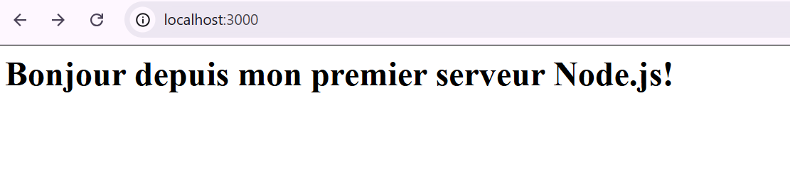
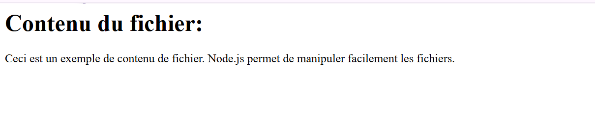
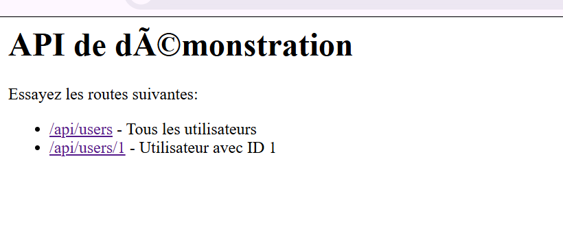
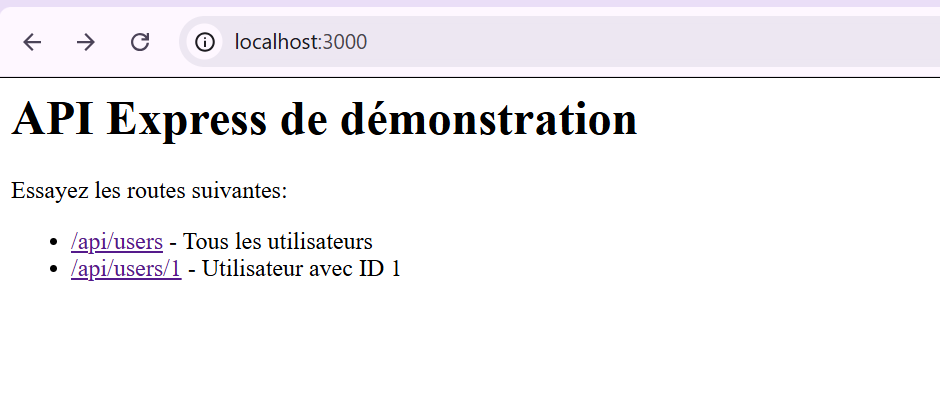
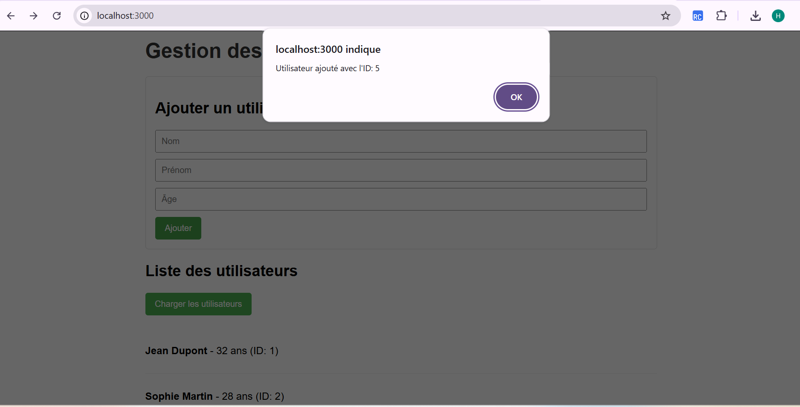

# TP 1 : Premiers pas avec Node.js - Backend JavaScript

## 📋 Description

Ce projet est un exercice pratique d'introduction au développement backend avec Node.js. Il guide l'apprenant à travers la création progressive d'une application web complète, depuis un simple serveur HTTP jusqu'à une API RESTful complète avec interface utilisateur.

## 🎯 Objectifs pédagogiques

- Comprendre l'installation et la configuration de Node.js
- Maîtriser les modules natifs de Node.js (`http`, `fs`, `path`, `url`)
- Créer un serveur HTTP manuellement
- Manipuler des fichiers de manière asynchrone
- Construire une API RESTful
- Utiliser Express.js pour simplifier le développement
- Gérer les variables d'environnement avec `dotenv`
- Mettre en place une journalisation des requêtes avec `morgan`
- Développer une interface utilisateur simple pour interagir avec l'API

## 📚 Prérequis

- Connaissances de base en JavaScript
- Un éditeur de code (VS Code recommandé)
- Un navigateur web moderne

## 🛠️ Technologies utilisées

| Technologie | Version | Description |
|-------------|---------|-------------|
| Node.js | LTS | Environnement d'exécution JavaScript |
| Express.js | 4.x | Framework web pour Node.js |
| Morgan | 1.x | Middleware de journalisation HTTP |
| Dotenv | 16.x | Gestion des variables d'environnement |

## 📁 Structure du projet

mon-premier-projet-nodejs/

│
├── public/ # Fichiers statiques
│ └── index.html # Interface utilisateur
│

├── .env # Variables d'environnement

├── data.txt # Fichier texte d'exemple

├── users.json # Base de données JSON des utilisateurs

├── server.js # Serveur HTTP simple (étapes 3-5)

├── app.js # Application Express complète (étapes 6-7)

├── package.json # Dépendances et scripts

└── package-lock.json # Verrouillage des versions

## Resultat

